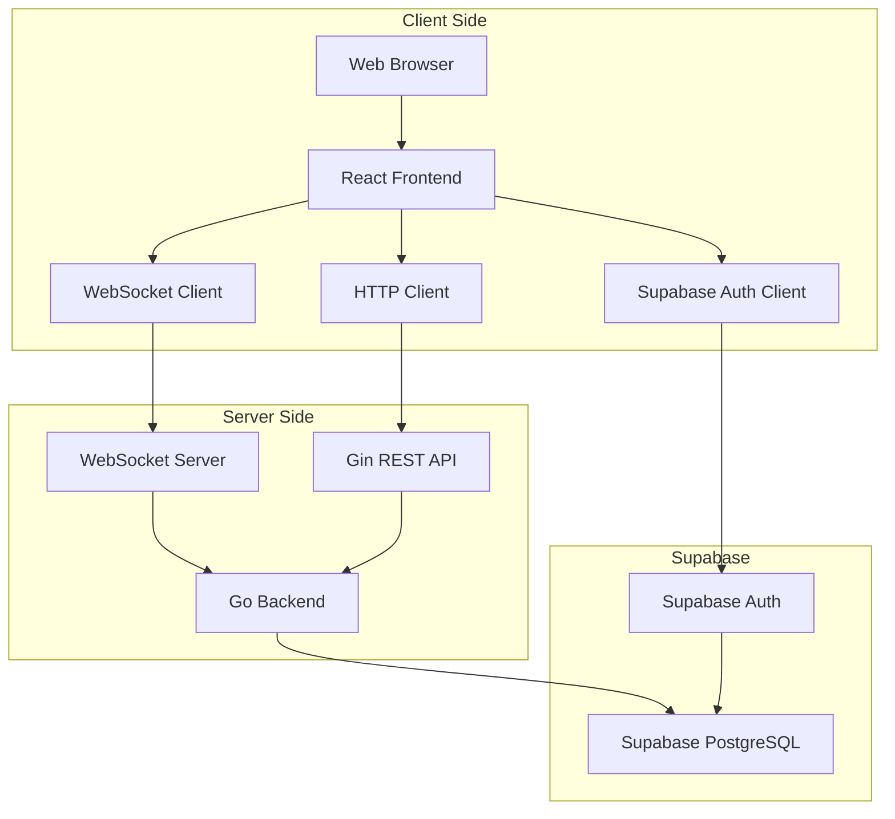

# Design Document

## Overview

The Collaborative Bucket List web application is a real-time, responsive web app that enables groups to collectively create and manage shared bucket lists. The system uses a modern web stack with real-time synchronization to provide seamless collaboration across devices.

### Technology Stack

- **Frontend**: React with TypeScript for type safety and component-based architecture
- **Backend**: Go with Gin framework for the REST API and WebSocket server
- **Database**: PostgreSQL hosted on Supabase for scalability and reliability
- **Authentication**: Supabase Auth for user management and session handling
- **Real-time Communication**: WebSockets with Gorilla WebSocket library for live updates
- **Styling**: Tailwind CSS for responsive design and rapid development
- **Build Tool**: Vite for fast development and optimized builds

## Architecture

### System Architecture



### Application Flow

1. **Authentication**: User signs in via Supabase Auth → JWT token stored for API requests
2. **Group Management**: Authenticated user can create multiple groups → Each group gets unique ID and shareable link → All groups stored in Supabase PostgreSQL
3. **Group Discovery**: User can view all groups they've created or joined → Dashboard shows group list with progress indicators
4. **Group Joining**: User clicks shared link → Frontend validates group → User enters name → Added to group via Supabase
5. **Real-time Updates**: Any user action → Go WebSocket server broadcasts to all connected clients in that group → UI updates instantly
6. **Data Persistence**: All actions saved to Supabase PostgreSQL with automatic backups and scaling

## Components and Interfaces

### Frontend Components

#### Core Components

- **App**: Main application wrapper with routing and authentication
- **HomePage**: Landing page with create/join options for unauthenticated users
- **Dashboard**: User dashboard showing all groups they've created or joined
- **GroupView**: Main bucket list interface for a specific group
- **CreateGroupForm**: Group creation with name and optional deadline
- **JoinGroupForm**: Name entry for joining existing groups
- **BucketListItem**: Individual list item with completion toggle
- **AddItemForm**: Form for adding new bucket list items
- **MembersList**: Display of group members
- **ProgressIndicators**: Countdown timer and completion progress bars
- **GroupCard**: Summary card showing group info, progress, and quick actions

#### Shared Components

- **ProgressBar**: Reusable progress bar for both time and completion tracking
- **CountdownTimer**: Real-time countdown display with color-coded urgency
- **LoadingSpinner**: Loading states during API calls
- **ErrorBoundary**: Error handling wrapper

### Backend API Endpoints

#### REST API

```
POST /api/groups
- Create new group (requires authentication)
- Headers: Authorization: Bearer <jwt_token>
- Body: { name: string, deadline?: string }
- Returns: { id: string, name: string, shareLink: string, deadline?: string }

GET /api/groups/:id
- Get group details and items
- Returns: { group: Group, members: Member[], items: BucketListItem[] }

POST /api/groups/:id/join
- Join existing group
- Body: { memberName: string, userId?: string }
- Returns: { member: Member }

POST /api/groups/:id/items
- Add new bucket list item
- Body: { title: string, description?: string, memberId: string }
- Returns: { item: BucketListItem }

PATCH /api/items/:id/complete
- Toggle item completion status
- Body: { completed: boolean, memberId: string }
- Returns: { item: BucketListItem }

GET /api/users/groups
- Get all groups for authenticated user (created or joined)
- Headers: Authorization: Bearer <jwt_token>
- Returns: { groups: GroupSummary[] }

POST /api/auth/verify
- Verify Supabase JWT token
- Headers: Authorization: Bearer <jwt_token>
- Returns: { user: User, valid: boolean }
```

#### WebSocket Events

```
// Client to Server
'join-group': { groupId: string, memberId: string }
'add-item': { groupId: string, item: NewBucketListItem }
'toggle-completion': { groupId: string, itemId: string, completed: boolean }

// Server to Client
'member-joined': { member: Member }
'item-added': { item: BucketListItem }
'item-updated': { item: BucketListItem }
'group-updated': { group: Group }
```

## Data Models

### Database Schema

```sql
-- Groups table
CREATE TABLE groups (
    id UUID PRIMARY KEY DEFAULT gen_random_uuid(),
    name TEXT NOT NULL,
    deadline TIMESTAMPTZ, -- PostgreSQL timestamp with timezone
    created_at TIMESTAMPTZ NOT NULL DEFAULT NOW(),
    created_by UUID NOT NULL REFERENCES auth.users(id)
);

-- Members table
CREATE TABLE members (
    id UUID PRIMARY KEY DEFAULT gen_random_uuid(),
    group_id UUID NOT NULL REFERENCES groups(id) ON DELETE CASCADE,
    user_id UUID REFERENCES auth.users(id), -- For authenticated users
    name TEXT NOT NULL,
    joined_at TIMESTAMPTZ NOT NULL DEFAULT NOW(),
    is_creator BOOLEAN DEFAULT FALSE
);

-- Bucket list items table
CREATE TABLE bucket_items (
    id UUID PRIMARY KEY DEFAULT gen_random_uuid(),
    group_id UUID NOT NULL REFERENCES groups(id) ON DELETE CASCADE,
    title TEXT NOT NULL,
    description TEXT,
    completed BOOLEAN DEFAULT FALSE,
    completed_by UUID REFERENCES members(id),
    completed_at TIMESTAMPTZ,
    created_by UUID NOT NULL REFERENCES members(id),
    created_at TIMESTAMPTZ NOT NULL DEFAULT NOW()
);

-- Indexes for performance
CREATE INDEX idx_groups_created_by ON groups(created_by);
CREATE INDEX idx_members_group_id ON members(group_id);
CREATE INDEX idx_members_user_id ON members(user_id);
CREATE INDEX idx_bucket_items_group_id ON bucket_items(group_id);
CREATE INDEX idx_bucket_items_created_by ON bucket_items(created_by);
```

### Go Structs

```go
type Group struct {
    ID        string     `json:"id" db:"id"`
    Name      string     `json:"name" db:"name"`
    Deadline  *time.Time `json:"deadline,omitempty" db:"deadline"`
    CreatedAt time.Time  `json:"createdAt" db:"created_at"`
    CreatedBy string     `json:"createdBy" db:"created_by"`
}

type Member struct {
    ID        string    `json:"id" db:"id"`
    GroupID   string    `json:"groupId" db:"group_id"`
    UserID    *string   `json:"userId,omitempty" db:"user_id"`
    Name      string    `json:"name" db:"name"`
    JoinedAt  time.Time `json:"joinedAt" db:"joined_at"`
    IsCreator bool      `json:"isCreator" db:"is_creator"`
}

type BucketListItem struct {
    ID          string     `json:"id" db:"id"`
    GroupID     string     `json:"groupId" db:"group_id"`
    Title       string     `json:"title" db:"title"`
    Description *string    `json:"description,omitempty" db:"description"`
    Completed   bool       `json:"completed" db:"completed"`
    CompletedBy *string    `json:"completedBy,omitempty" db:"completed_by"`
    CompletedAt *time.Time `json:"completedAt,omitempty" db:"completed_at"`
    CreatedBy   string     `json:"createdBy" db:"created_by"`
    CreatedAt   time.Time  `json:"createdAt" db:"created_at"`
}

type GroupWithDetails struct {
    Group   `json:",inline"`
    Members []Member         `json:"members"`
    Items   []BucketListItem `json:"items"`
}

type GroupSummary struct {
    Group         `json:",inline"`
    MemberCount   int     `json:"memberCount"`
    ItemCount     int     `json:"itemCount"`
    CompletedCount int    `json:"completedCount"`
    ProgressPercent float64 `json:"progressPercent"`
}

type SupabaseUser struct {
    ID    string `json:"id"`
    Email string `json:"email"`
}
```

### TypeScript Frontend Interfaces

```typescript
interface Group {
  id: string;
  name: string;
  deadline?: string;
  createdAt: string;
  createdBy: string;
}

interface Member {
  id: string;
  groupId: string;
  userId?: string;
  name: string;
  joinedAt: string;
  isCreator: boolean;
}

interface BucketListItem {
  id: string;
  groupId: string;
  title: string;
  description?: string;
  completed: boolean;
  completedBy?: string;
  completedAt?: string;
  createdBy: string;
  createdAt: string;
}

interface GroupWithDetails extends Group {
  members: Member[];
  items: BucketListItem[];
}

interface SupabaseUser {
  id: string;
  email: string;
}
```

## Error Handling

### Client-Side Error Handling

- **Network Errors**: Retry mechanism with exponential backoff
- **Invalid Group Links**: Redirect to home with error message
- **WebSocket Disconnection**: Automatic reconnection with visual indicator
- **Form Validation**: Real-time validation with user-friendly messages

### Server-Side Error Handling

- **Database Errors**: Proper error logging and graceful degradation
- **Invalid Requests**: Structured error responses with appropriate HTTP status codes
- **Rate Limiting**: Prevent spam and abuse with request throttling
- **CORS Configuration**: Proper cross-origin resource sharing setup

### Error Response Format

```typescript
interface ErrorResponse {
  error: {
    code: string;
    message: string;
    details?: any;
  };
}
```

## Testing Strategy

### Frontend Testing

- **Unit Tests**: Jest and React Testing Library for component testing
- **Integration Tests**: Test user flows and API integration
- **E2E Tests**: Playwright for full application testing across browsers
- **Real-time Testing**: Mock Socket.IO connections for WebSocket functionality

### Backend Testing

- **Unit Tests**: Go testing package with testify for assertions
- **Integration Tests**: httptest for API endpoint testing with Gin
- **Database Tests**: Dockerized PostgreSQL or testcontainers for isolated testing
- **WebSocket Tests**: Gorilla WebSocket testing utilities for real-time features
- **Supabase Integration Tests**: Mock Supabase client for authentication testing

### Test Coverage Goals

- Minimum 80% code coverage for critical paths
- 100% coverage for data validation and security functions
- Comprehensive testing of real-time synchronization scenarios

### Performance Considerations

#### Frontend Optimization

- **Code Splitting**: Lazy load components to reduce initial bundle size
- **Memoization**: React.memo and useMemo for expensive computations
- **Debouncing**: Limit API calls for real-time features
- **Caching**: Local storage for group membership and recent data

#### Backend Optimization

- **Database Indexing**: Proper indexes on frequently queried columns
- **Connection Pooling**: Efficient database connection management
- **Rate Limiting**: Prevent abuse and ensure fair resource usage
- **Compression**: Gzip compression for API responses

#### Real-time Performance

- **Room-based Broadcasting**: Only send updates to relevant group members
- **Event Throttling**: Limit frequency of certain real-time events
- **Connection Management**: Efficient WebSocket connection handling
